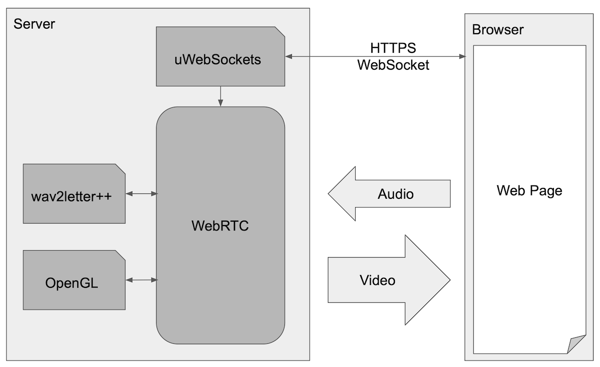

# Voice RTC

A proof of concept how to use WebRTC to build an interactive speech recognition system.

The web page displays a video with an audio signal, where small black dots indicate recognised words.

## Components

1. WebRTC
2. uWebSockets
3. FBGEMM
4. flashlight
5. wav2letter++
6. OSMesa
7. GLU
8. rapidjson

## TODO
- [ ] Display recognised words
- [ ] Multi-user connection