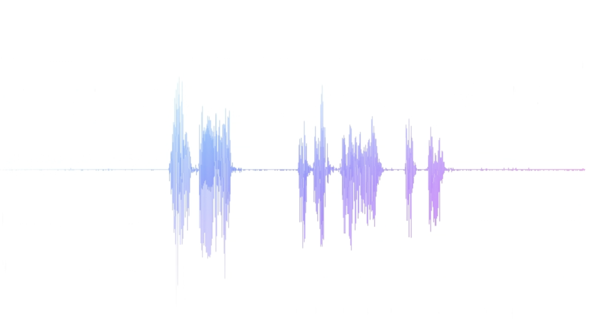

# Voice RTC

A proof of concept how to use WebRTC to build an interactive speech recognition system.

## Dependencies

1. WebRTC
2. uWebSockets
3. FBGEMM
4. flashlight
5. wav2letter++
6. OSMesa
7. GLU
8. rapidjson
